<a href="https://www.lucasbatista.com">
  <picture>
    <source media="(max-width: 640px) and (prefers-color-scheme: dark)" srcset="assets/branding/hero-mobile-dark.svg">
    <source media="(max-width: 640px)" srcset="assets/branding/hero-mobile-light.svg">
    <source media="(prefers-color-scheme: dark)" srcset="assets/branding/hero-dark.svg">
    
  </picture>
</a>

  <a href="https://www.lucasbatista.com"><picture><source media="(prefers-color-scheme: dark)" srcset="assets/buttons/btn-portfolio-dark.svg"></picture></a>
  <a href="https://www.cupcakelabs.com.br"><picture><source media="(prefers-color-scheme: dark)" srcset="assets/buttons/btn-cupcakelabs-dark.svg"></picture></a>
  <a href="https://www.linkedin.com/in/lucaspbatista/"><picture><source media="(prefers-color-scheme: dark)" srcset="assets/buttons/btn-linkedin-dark.svg"></picture></a>
  <a href="#contato"><picture><source media="(prefers-color-scheme: dark)" srcset="assets/buttons/btn-contato-dark.svg"></picture></a>

  <a href="#sobre">Sobre</a> ·
  <a href="#projetos-em-destaque">Projetos</a> ·
  <a href="#para-clientes">Clientes</a> ·
  <a href="#stack">Stack</a> ·
  <a href="#atividade">Atividade</a> ·
  <a href="#contato">Contato</a>

## Sobre

Sou desenvolvedor full stack e mobile e fundador da [CupCakeLabs](https://www.cupcakelabs.com.br). Construo produtos inteiros: da modelagem do banco e da API à interface web, ao app na loja e ao instalador desktop — e continuo cuidando deles em produção, com deploy, cobrança, atualização e suporte.

Hoje mantenho meus próprios produtos (**Vendaí**, **Petzara**, **Trativa** e **QRPronto**), desenvolvo sistemas sob medida para clientes e, como projeto de estudo, escrevo um sistema operacional em Rust.

- **Web:** React, Next.js e TypeScript, com foco em interfaces claras e rápidas.
- **Mobile e desktop:** Flutter, Electron e PWA, incluindo operação offline-first e integração com impressora térmica e balança.
- **Back-end:** Node.js (Express e NestJS), PostgreSQL e MongoDB, multiempresa e tempo real.
- **Integrações:** Stripe, PIX, WhatsApp Cloud API, frete e Meta Pixel.

<b>English summary</b>

 

Full stack & mobile developer from Brazil and founder of [CupCakeLabs](https://www.cupcakelabs.com.br). I build complete products — database, API, web app, mobile app and desktop installer — and keep running them in production. I maintain my own SaaS products (Vendaí, Petzara, Trativa, QRPronto), build custom software for clients and, as a study project, write an operating system in Rust ([Nexo OS](https://github.com/LucasBatista37/nexo-os)). Full case studies (in Portuguese) at [lucasbatista.com](https://www.lucasbatista.com/projects).

## Projetos em destaque

Produtos que desenvolvi de ponta a ponta. Clique em um card para abrir o case completo, com vídeos do sistema funcionando.

  <a href="https://www.lucasbatista.com/projects/vendai"><picture><source media="(prefers-color-scheme: dark)" srcset="assets/projects/vendai-dark.webp">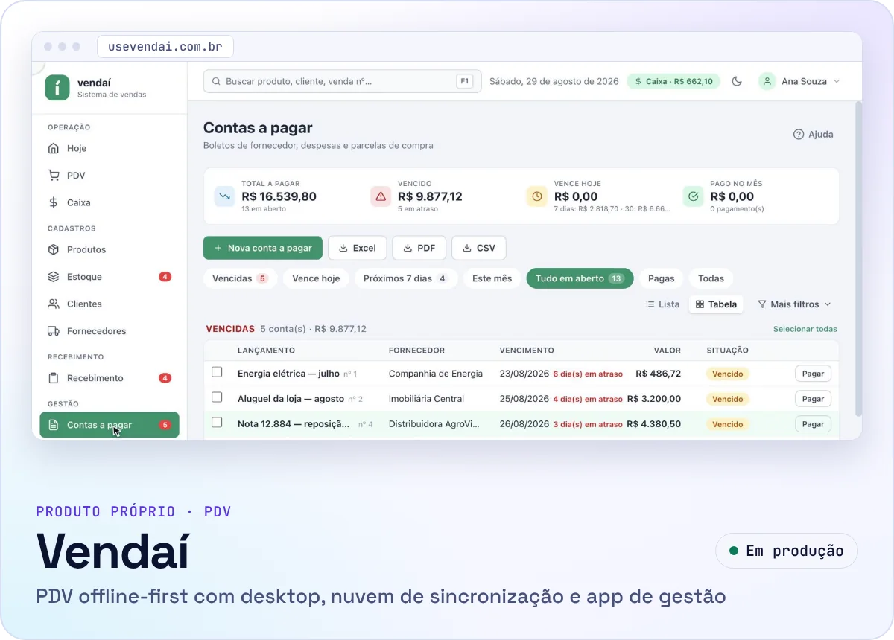</picture></a>
  <a href="https://www.lucasbatista.com/projects/petzara"><picture><source media="(prefers-color-scheme: dark)" srcset="assets/projects/petzara-dark.webp">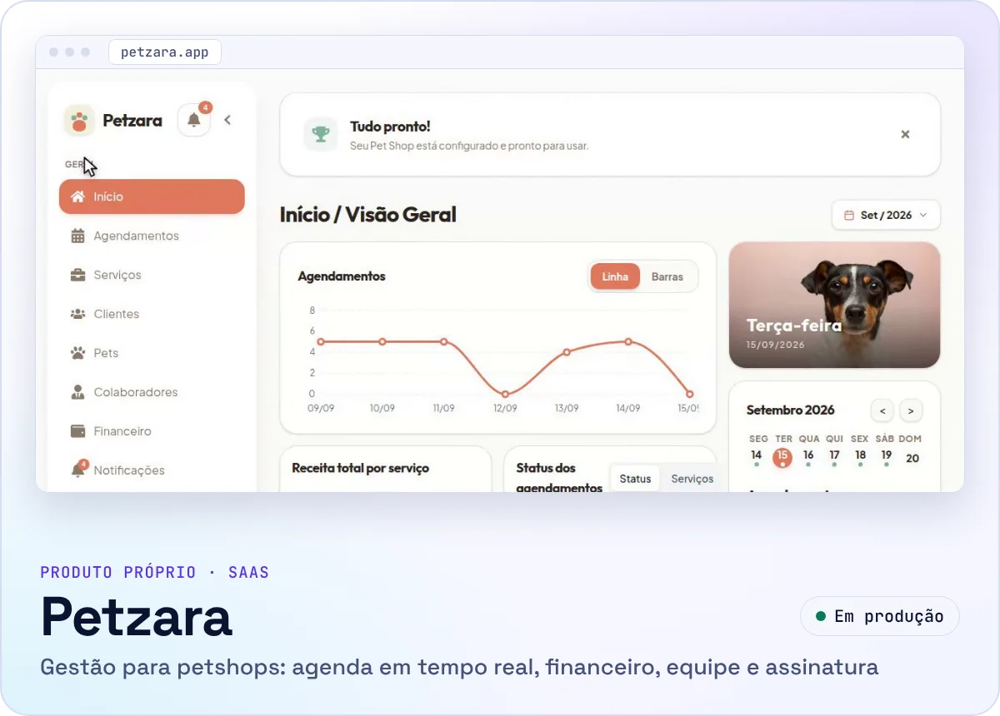</picture></a>
  <a href="https://www.lucasbatista.com/projects/trativa"><picture><source media="(prefers-color-scheme: dark)" srcset="assets/projects/trativa-dark.webp">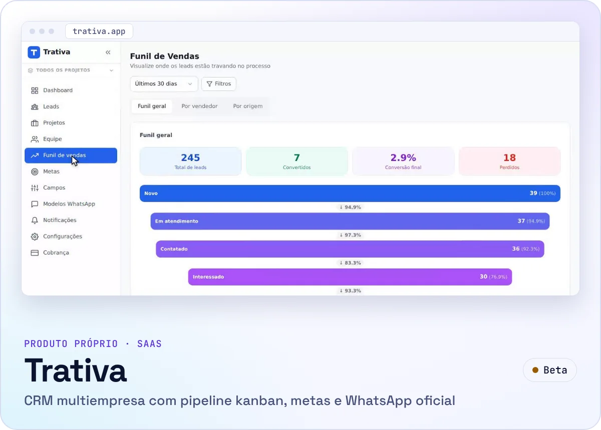</picture></a>
  <a href="https://www.lucasbatista.com/projects/qrpronto"><picture><source media="(prefers-color-scheme: dark)" srcset="assets/projects/qrpronto-dark.webp">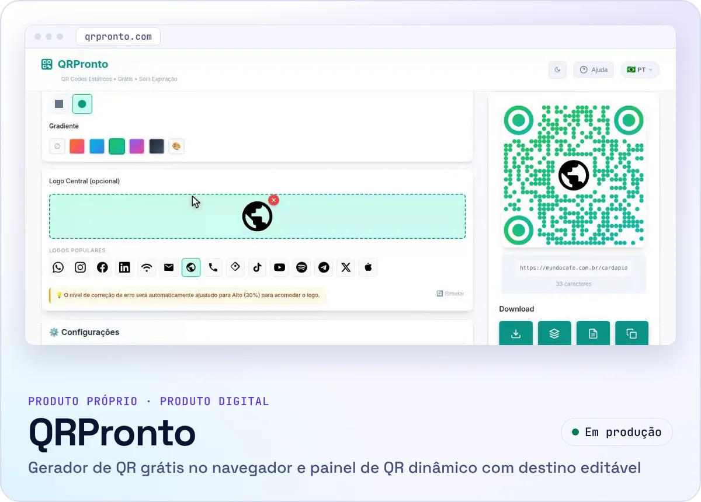</picture></a>
  <a href="https://www.lucasbatista.com/projects/ciclou"><picture><source media="(prefers-color-scheme: dark)" srcset="assets/projects/ciclou-dark.webp">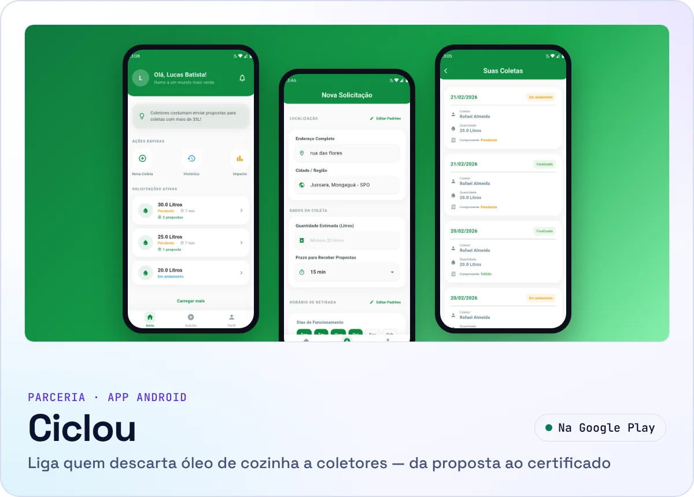</picture></a>
  <a href="https://github.com/LucasBatista37/nexo-os"><picture><source media="(prefers-color-scheme: dark)" srcset="assets/projects/nexo-os-dark.webp">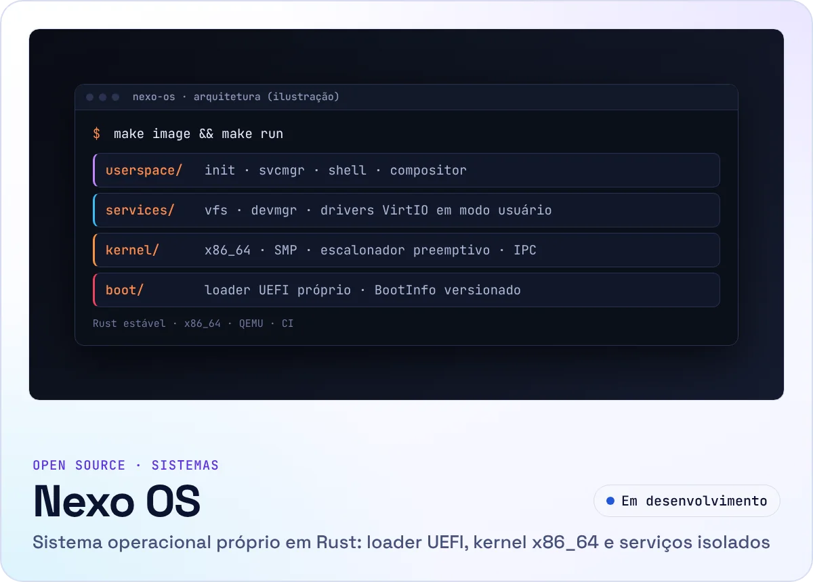</picture></a>

**[Vendaí](https://usevendai.com.br)** · produto próprio, em produção 
PDV para pequenos comércios que funciona sem internet: leitor de código de barras, caixa, estoque, fiado, contas a pagar, PIX e relatórios, com sincronização para a nuvem e app de gestão no celular. 
Electron · React · SQLite · Node.js · PostgreSQL · Flutter — [case](https://www.lucasbatista.com/projects/vendai) · [downloads](https://github.com/LucasBatista37/vendai-releases)

**[Petzara](https://petzara.app)** · produto próprio, em produção 
Gestão para petshops de banho e tosa: agenda com status em tempo real, clientes e pets, financeiro, equipe, link público de agendamento e assinatura via Stripe. Instalável como PWA. 
React · Node.js · Express · MongoDB · Socket.io · Stripe — [case](https://www.lucasbatista.com/projects/petzara) · [app desktop](https://github.com/LucasBatista37/petzara-desktop)

**[Trativa](https://trativa.app)** · produto próprio, em beta 
CRM multiempresa para equipes comerciais: pipeline kanban, WhatsApp Cloud API dentro da ficha do lead, campos personalizados, metas, relatórios de funil e app desktop. 
React · Vite · Node.js · MongoDB · Socket.IO · Electron — [case](https://www.lucasbatista.com/projects/trativa) · [landing page](https://github.com/LucasBatista37/trativa-landing-page) · [app desktop](https://github.com/LucasBatista37/trativa-desktop)

**[QRPronto](https://qrpronto.com)** · produto próprio, em produção 
Dois produtos em um: gerador de QR Code com 17 tipos que roda inteiro no navegador, sem cadastro, e um painel de QR dinâmico em que o destino do código impresso pode ser trocado, com campanhas, webhooks e API. 
React · TypeScript · NestJS · Prisma — [case](https://www.lucasbatista.com/projects/qrpronto)

**[Ciclou](https://www.ciclou.app)** · parceria, publicado na Google Play 
App que liga quem descarta óleo de cozinha a coletores: o gerador pede a coleta, coletores enviam propostas, a taxa é paga via PIX e o app emite o certificado de destinação. Fiz a interface Flutter, os fluxos de usuário e a integração com Firebase, em parceria com Rafael Almeida (back-end e design). 
Flutter · Dart · Firebase — [Google Play](https://play.google.com/store/apps/details?id=com.beyondsystem.ciclou_novo_app) · [case](https://www.lucasbatista.com/projects/ciclou)

**[Nexo OS](https://github.com/LucasBatista37/nexo-os)** · open source, em desenvolvimento 
Sistema operacional escrito do zero em Rust estável: loader UEFI próprio, kernel x86_64 com SMP e escalonador preemptivo, processos em modo usuário com IPC por canais, drivers VirtIO isolados e sistema de arquivos próprio, com cenários de teste em QEMU no CI. 
Rust · x86_64 · UEFI · QEMU — [repositório](https://github.com/LucasBatista37/nexo-os) · [roadmap](https://github.com/LucasBatista37/nexo-os/blob/main/docs/ROADMAP_STATUS.md)

<b>Ver os produtos em ação</b> (prévias animadas, ~700 KB)

 

Trechos dos vídeos publicados nos cases, com dados de demonstração.

  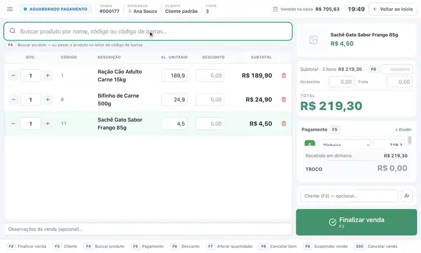
  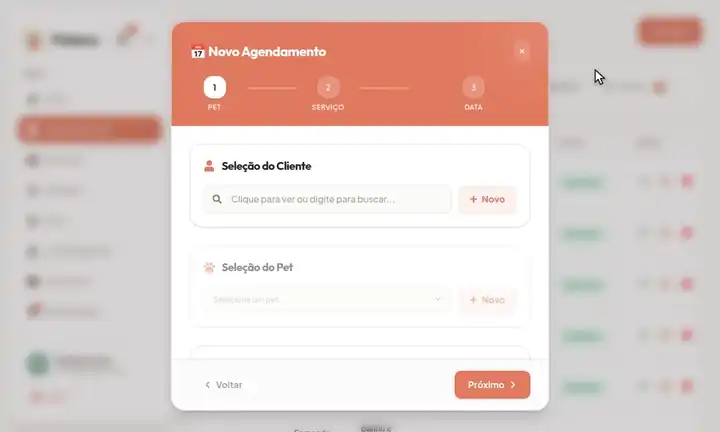
  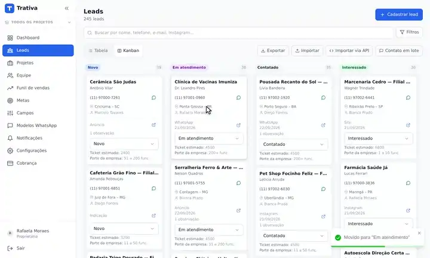
  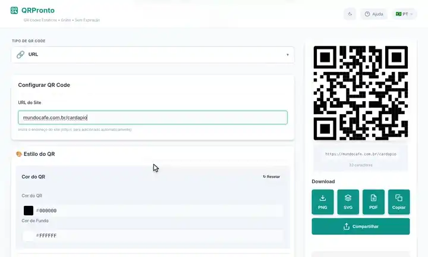
  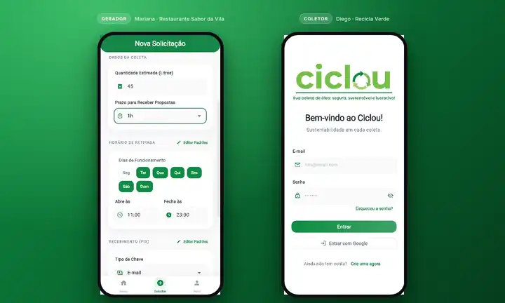

## Para clientes

Sistemas e sites sob medida, desenvolvidos para empresas.

  <a href="https://www.lucasbatista.com/projects/eacentral"><picture><source media="(prefers-color-scheme: dark)" srcset="assets/projects/client-eacentral-dark.webp">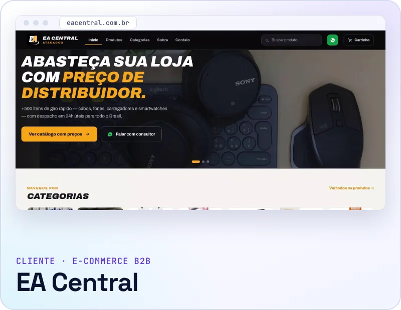</picture></a>
  <a href="https://www.lucasbatista.com/projects/mais-clean"><picture><source media="(prefers-color-scheme: dark)" srcset="assets/projects/client-maisclean-dark.webp">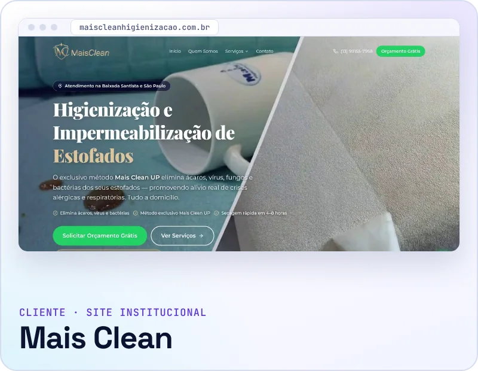</picture></a>
  <a href="https://www.lucasbatista.com/projects/gesso-grande-rocha"><picture><source media="(prefers-color-scheme: dark)" srcset="assets/projects/client-gesso-dark.webp">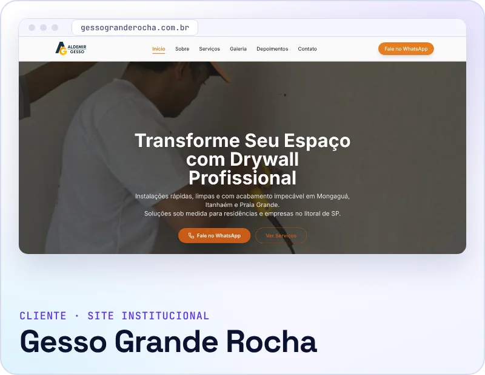</picture></a>

- **[EA Central](https://eacentral.com.br)** — e-commerce de atacado com preço progressivo, filtro por aparelho e pedido pelo WhatsApp; vitrine React, painel administrativo e API Node/PostgreSQL. [case](https://www.lucasbatista.com/projects/eacentral)
- **[Mais Clean Higienização](https://www.maiscleanhigienizacao.com.br)** — site em Next.js com uma página por serviço, SEO local, vídeos do processo e PWA. [case](https://www.lucasbatista.com/projects/mais-clean)
- **[Gesso Grande Rocha](https://www.gessogranderocha.com.br)** — site em React com páginas por cidade, SEO local e avaliações do Google. [case](https://www.lucasbatista.com/projects/gesso-grande-rocha) · [código](https://github.com/LucasBatista37/GessoGrandeRocha)
- **Em andamento pela CupCakeLabs:** [Ecogn](https://www.cupcakelabs.com.br/projetos/ecogn), plataforma de gestão ambiental, recursos hídricos e SST levada de protótipo a produção, e [NorteOS](https://www.cupcakelabs.com.br/projetos/norteos), continuidade técnica de um sistema de gestão médica e hospitalar em produção.

## Stack

<picture>
  <source media="(max-width: 640px) and (prefers-color-scheme: dark)" srcset="assets/sections/stack-mobile-dark.svg">
  <source media="(max-width: 640px)" srcset="assets/sections/stack-mobile-light.svg">
  <source media="(prefers-color-scheme: dark)" srcset="assets/sections/stack-dark.svg">
  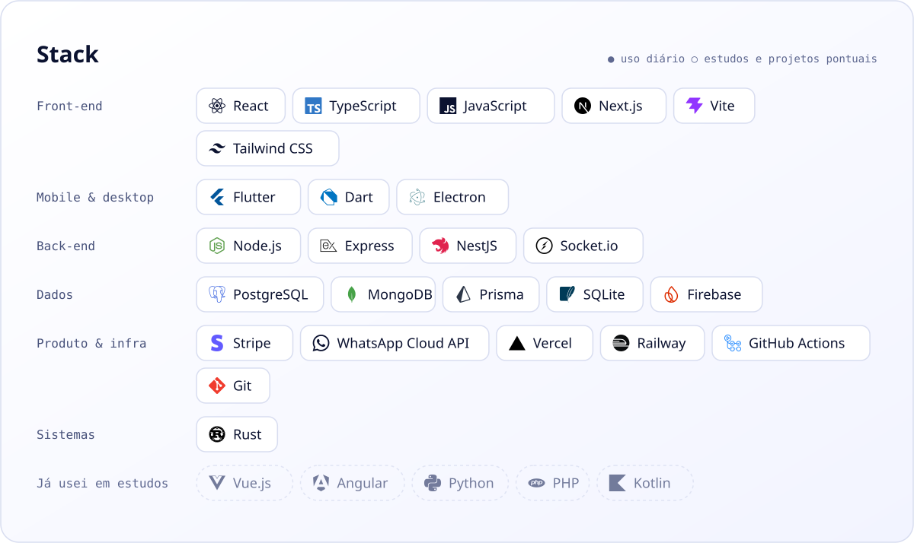
</picture>

<b>Outros projetos</b> — estudos, trabalhos acadêmicos e sites anteriores

 

**Acadêmico, em equipe**
- [Condoview](https://www.lucasbatista.com/projects/condoview) — app de condomínio em Flutter feito como TCC por uma equipe de 5: reservas, ocorrências, avisos e convite de visitante com QR Code. [app](https://github.com/LucasBatista37/Condoview-App) · [back-end](https://github.com/LucasBatista37/Backend-Condoview) · [vídeo](https://www.youtube.com/watch?v=E2fc69-hLe4)

**Estudos de front-end e full stack**
- [ReactGram](https://github.com/LucasBatista37/ReactGram) — rede social inspirada no Instagram, com autenticação JWT e upload de imagens (React, Node.js, MongoDB).
- [Miniblog](https://github.com/LucasBatista37/Miniblog) — blog com autenticação e CRUD de posts (React, Firebase).
- [Central Filmes](https://github.com/LucasBatista37/Central-Filmes) — catálogo e busca de filmes com a API do TMDB (React, Vite). [demo](https://centralfilmes.vercel.app)
- [Tarefa Rápida](https://github.com/LucasBatista37/Task_Typescript) — lista de tarefas em React com TypeScript. [demo](https://itask-typescript.vercel.app)
- [Angular Blog](https://github.com/LucasBatista37/Angular-Blog) — blog em Angular.

**Fundamentos de IA**
- [Perceptron](https://github.com/LucasBatista37/Perceptron-Python) e [rede neural multicamada](https://github.com/LucasBatista37/Rede-Neural-Multicamada) implementados do zero em Python.

**Sites anteriores**
- [Pet Litoral](https://github.com/LucasBatista37/Pet-Litoral-Page) e [Beyond](https://github.com/LucasBatista37/Beyond-Site) — sites em React; os domínios não estão mais no ar, o código continua público.

Lista completa em [repositórios](https://github.com/LucasBatista37?tab=repositories).

## Atividade

<picture>
  <source media="(max-width: 640px) and (prefers-color-scheme: dark)" srcset="https://raw.githubusercontent.com/LucasBatista37/LucasBatista37/output/activity-mobile-dark.svg">
  <source media="(max-width: 640px)" srcset="https://raw.githubusercontent.com/LucasBatista37/LucasBatista37/output/activity-mobile-light.svg">
  <source media="(prefers-color-scheme: dark)" srcset="https://raw.githubusercontent.com/LucasBatista37/LucasBatista37/output/activity-dark.svg">
  
</picture>

<picture>
  <source media="(prefers-color-scheme: dark)" srcset="https://raw.githubusercontent.com/LucasBatista37/LucasBatista37/output/snake-dark.svg">
  
</picture>

Gerados diariamente por GitHub Actions a partir do calendário público de contribuições (o mesmo do perfil, que já soma as contribuições privadas exibidas nele). A maior parte do código dos produtos é privada, então a contagem de linguagens dos repositórios públicos não representa a stack real.

## Contato

Tem um sistema, um app ou um SaaS para tirar do papel ou evoluir? Me conte o problema: respondo com perguntas, uma proposta de escopo por fases e prazo.

  <a href="https://wa.me/5513996830085?text=Ol%C3%A1%2C%20Lucas!%20Vi%20seu%20GitHub%20e%20quero%20conversar%20sobre%20um%20projeto."><picture><source media="(prefers-color-scheme: dark)" srcset="assets/buttons/btn-whatsapp-dark.svg"></picture></a>
  <a href="mailto:lucas.batista9734@gmail.com"><picture><source media="(prefers-color-scheme: dark)" srcset="assets/buttons/btn-email-dark.svg"></picture></a>

lucas.batista9734@gmail.com · +55 13 99683-0085 · [linkedin.com/in/lucaspbatista](https://www.linkedin.com/in/lucaspbatista/) · [lucasbatista.com](https://www.lucasbatista.com)

 

Feito com Markdown, SVG e GitHub Actions · sem rastreadores · os assets e a verificação de links ficam neste repositório

